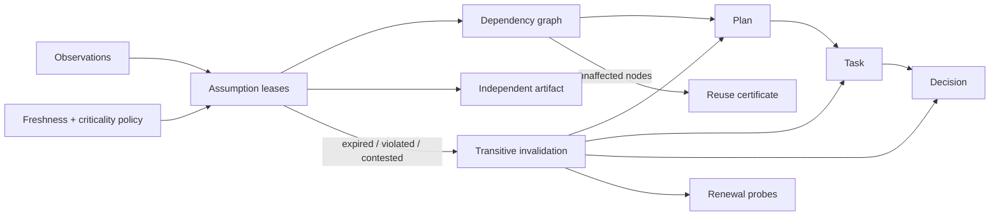

# AssumptionLease

**Expiring assumption contracts and transitive impact analysis for long-running AI agents.**

Plans rarely fail because an agent forgot the plan. They fail because the world changed underneath it. AssumptionLease turns hidden premises into explicit leases with predicates, observations, expiry times, owners, evidence, and renewal probes. When one premise expires or becomes false, the engine propagates invalidation through every dependent plan, task, decision, action, and artifact.

> Experimental developer tool. AssumptionLease evaluates declared predicates and dependencies; it does not discover every hidden assumption automatically.

## Why this exists

Long-running agents reuse plans, summaries, and intermediate artifacts across hours or days. A plan can remain internally consistent while its API version, budget, deployment state, business constraint, or tool capability has changed.

AssumptionLease changes the unit of reuse:

```text
"We made this decision"              (historical fact)
"Its premises are still leased"      (current permission to reuse)
```

## Core controls

| Control | Purpose |
| --- | --- |
| Expiring leases | Every assumption has `assertedAt` and `validUntil`. |
| Observable predicates | A path/operator/expected tuple makes the premise testable. |
| Freshness policy | Old observations cannot silently renew a lease. |
| Contention detection | Recent observations that disagree block the assumption. |
| Criticality budgets | Critical premises receive shorter maximum lease durations. |
| Evidence requirements | High-risk assumptions can require durable evidence references. |
| Transitive invalidation | Broken premises invalidate every downstream graph node. |
| Selective reuse | Independent artifacts remain reusable even when another branch fails. |
| Renewal plans | Failed leases produce explicit command, HTTP, file, or manual probes. |
| Regression diff | CI detects weakened policies, changed predicates, extended leases, and removed dependency edges. |
| Reuse certificate | A tamper-evident certificate lists only unaffected nodes. |

## Quick start

Requires Node.js 20+ and pnpm 10.

```bash
pnpm install
pnpm check

pnpm lease audit examples/sound-lease.json \
  --at 2026-07-29T06:00:00.000Z

pnpm lease audit examples/drifted-lease.json \
  --at 2026-07-29T06:00:00.000Z

pnpm lease renewals examples/drifted-lease.json \
  --at 2026-07-29T06:00:00.000Z
```

The drifted fixture invalidates an API assumption and an error-rate assumption. Their impact propagates through the rollout plan, migration task, and customer-notice decision. The unrelated budget report remains reusable.

## CLI

```text
assumption-lease audit <lease.json> [--at <ISO date>] [--json]
assumption-lease impact <lease.json> --node <id> [--at <ISO date>]
assumption-lease renewals <lease.json> [--at <ISO date>] [--json]
assumption-lease certify <lease.json> --output <certificate.json> [--at <ISO date>]
assumption-lease verify <certificate.json> [--lease <lease.json>]
assumption-lease diff <previous.json> <next.json> [--json]
assumption-lease init [path]
```

Exit codes: `0` sound/valid, `2` invalid, `3` degraded, `4` weakened contract, and `5` malformed input.

## Guard against moving goalposts

```bash
pnpm lease diff examples/sound-lease.json examples/weakened-lease.json
```

The command exits `4` when a new version widens freshness, extends critical leases, removes evidence rules, tolerates contested observations or graph cycles, lowers criticality, changes predicates, or removes dependency edges.

## Local Studio

```bash
pnpm dev
```

The Studio provides safe and drifted demos, editable JSON, a dependency-impact map, lease countdowns, renewal probes, and reuse-certificate downloads. Everything runs in the browser with no backend, model calls, telemetry, or API key.

## Model



See [docs/MODEL.md](docs/MODEL.md), [docs/INTEGRATION.md](docs/INTEGRATION.md), and [docs/THREAT-MODEL.md](docs/THREAT-MODEL.md).

## Research context

AssumptionLease responds to reliability problems emerging in longer-running agents:

- [Agent Drift](https://arxiv.org/abs/2601.04170) studies behavioral degradation over extended multi-agent interactions.
- [AgentFlow](https://arxiv.org/abs/2607.01640) models agent programs as typed dependency graphs for static analysis.
- [AI Planning Framework for LLM-Based Web Agents](https://arxiv.org/abs/2603.12710) discusses context drift and incoherent task decomposition.

This repository is an original experimental implementation of expiring assumption contracts, observation-bound predicates, transitive reuse invalidation, renewal probes, and contract-regression detection. Searches before publication found no exact GitHub repository or npm package named `AssumptionLease`; this is not a legal or global uniqueness guarantee.

## Repository layout

```text
packages/core     Lease audit, impact graph, renewal plan, diff, certificate
packages/cli      Automation-friendly command-line interface
apps/studio       Local-first visual workbench
examples          Sound, drifted, and weakened lease documents
docs              Model, integration, and threat boundaries
```

MIT licensed.
